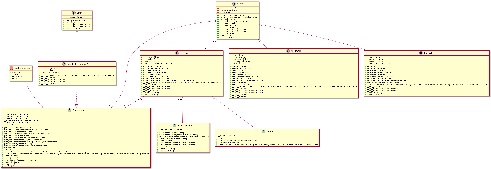

# Compte-rendu MonAUTO

## Comment utiliser MonAUTO

```bash
git clone https://github.com/Joffref/TP_GLA.git
cd TP_GLA
python3 MonAuto/CodeBase/main.py
```

## UML des classes du projet MonAuto
> Malgrè la [correction apporté aux diagramme de classes](https://github.com/Cherfalyes/GLA-2022/pull/2/commits/015bb8b5bf9e54be424be8951562ed55959e3676) lors de l'échange en cours de TP, j'ai décidé de rester sur ma première approche qui est discutable tant elle prends de manière tranché position quant à la qualité du code attendu.


